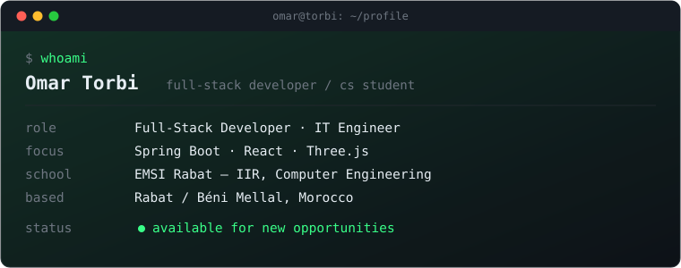

  
  
    

  
  
  
  
  

 

# 👋 Welcome to my GitHub Profile!

### Hi! My name is Omar Torbi
**Full-Stack Developer | 3D WebCAD & Cloud Systems | Engineering Student — EMSI**

* 🎓 **Computer and Network Engineering (IIR)** student at **EMSI Rabat**
* 💻 **Full-Stack Developer** passionate about modern architectures, robust APIs, and browser-native 3D applications
* 📐 Currently engineering a browser-based **parametric 3D CAD & CNC laser cutting engine** for **Zahiri Metal** (*React, Three.js, OpenCascade.js WASM*)
* ⚙️ Designing secure enterprise backends with **Java & Spring Boot**, **Django**, and **Laravel**
* 🧠 Implementing semantic search and contextual RAG pipelines using **ChromaDB** and the **Gemini API**
* 🗄️ Relational schema design and performance tuning on **MySQL**, **Oracle DB**, and **PostgreSQL**
* ☁️ Containerization, CI/CD, and cloud workflows with **Docker**, **Linux**, **OCI (Oracle Cloud)**, and **Vercel**
* 🌍 I'm based in **Rabat, Morocco**
* 🖥️ See my portfolio at **[torbiomar.vercel.app](https://torbiomar.vercel.app/)**
* ✉️ You can contact me at **[torbi.dev@outlook.com](mailto:torbi.dev@outlook.com)**
* 👥 I'm looking to collaborate on **Full-Stack Applications**, **3D Web Engineering**, and **Cloud/AI Systems**

---

## 🛠️ Skills

### 🖥️ Frontend & 3D Development

  
  
  
  
  
  

### ⚙️ Backend Development

  
  
  
  
  

### 🗄️ Databases & Vector Retrieval

  
  
  
  

### 🚀 Cloud, DevOps & AI

  
  
  
  
  

---

## 📌 Featured Projects

* **[3D CAD & Laser Cutting Engine](https://zahiri-metal-3d-cad.vercel.app/)** — Browser-based CAD kernel integration for parametric tube modeling and dynamic CNC fiber laser geometry calculation (*React, Three.js, OpenCascade.js, TypeScript*).
* **Elevate Recruitment Platform** — Role-based recruitment platform with granular access control and structured hiring pipelines (*Spring Boot, Spring Security, React, MySQL*).
* **Sofia Digital Library** — Low-latency digital study environment featuring contextual document retrieval over PDF files (*Spring Boot, ChromaDB, Gemini API, MySQL*).
* **True Shuffler** — Spotify Web API client implementing true-randomized playlist-shuffling logic (*React, Node.js*).

---

## 📊 GitHub Stats

  
  

